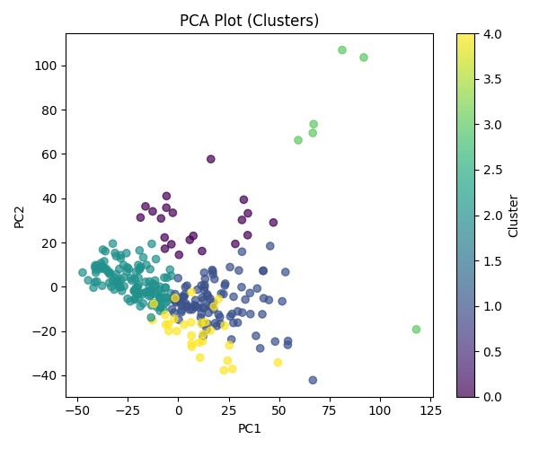
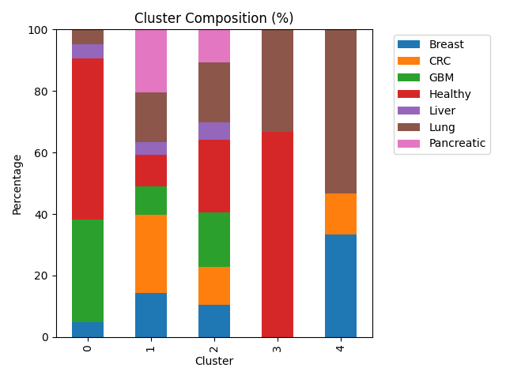
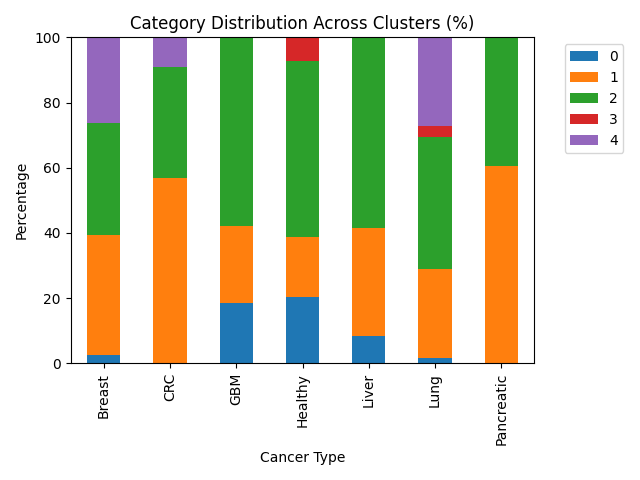

# Exploratory clustering of multi-cancer RNA-seq profiles

## Problem Statement

Gene expression data from several cancer types may still carry structure that unsupervised methods can surface without using labels in the learning step. This work asks whether such structure appears when we reduce dimensionality with principal component analysis (PCA), partition samples with k-means clustering, and examine how the resulting clusters mix or separate known cancer types. We do not treat the task as building a predictive model; the purpose is to describe emergent patterns in the data and to see how far they line up with existing cancer-type categories.

## Dataset

We use RNA-seq gene expression profiles from several malignancies together with healthy controls. Rows index genes and columns index patient samples; matrix entries are continuous expression values. The matrix has 57,736 genes and 285 samples.

Represented groups include breast (BRCA), lung (NSCLC), colorectal (CRC), glioblastoma (GBM), pancreatic and liver-related samples, and healthy controls.

Records come from GEO accession [GSE68086](https://www.ncbi.nlm.nih.gov/geo/query/acc.cgi?acc=GSE68086) (Tumor-Educated Platelets RNA-seq). Cancer type (and related information) appears in the sample identifiers; we parse these strings to obtain labels used only after clustering, for interpretation and comparison.

## Preprocessing

The raw table needed a few consistent steps before PCA and clustering.

### Data loading

We read a tab-delimited file, skipped leading metadata rows, and kept the numeric expression block. Gene symbols (or identifiers) were set as row labels.

### Cleaning and missing values

Values were cast to numeric types; entries that could not be parsed became missing (`NaN`). Genes whose row was entirely missing were dropped so every remaining row had at least one observed value.

### Label extraction

Tissue or disease group was inferred from text embedded in each column name. Samples were tagged as breast, lung, CRC, GBM, pancreatic, liver, or healthy. These tags were not supplied to the unsupervised steps; they were used afterward to read clusters against known groups.

### Unknown labels

A small number of columns did not map cleanly to the scheme above and were marked `Unknown`. Those columns were excluded before PCA and *k*-means so later comparisons use only samples with an unambiguous label.

### Orientation for modeling

The matrix was transposed so that each **row** is one sample and each **column** is one gene—the layout expected by standard PCA and clustering routines in our toolchain.

### Scaling

Gene-wise *z*-scores were applied (mean 0, unit variance per feature) so distance-based methods are not driven only by genes with larger raw dynamic range.

## Feature selection

After preprocessing, the sample-by-gene matrix is still very wide. We therefore kept only the genes that vary most across samples: for each gene we computed the variance over samples and retained the 2,000 genes with the largest values.

The idea is straightforward—genes with almost flat expression add little separation between samples but still inflate dimensionality and runtime. Truncating to the top-variance set is a simple filter before PCA and clustering; it is not meant to recover biology on its own, only to focus the analysis on more discriminative coordinates.

## Dimensionality reduction (PCA)

Even after variance filtering, each sample still lives in thousands of dimensions. Principal component analysis (PCA) compresses that space into a few uncorrelated directions (principal components), ordered so that earlier components explain more of the total variance. Geometrically, each component is a weighted sum of the retained genes; later components typically carry finer, noisier variation.

We use PCA for two practical reasons: it gives a compact representation that is easier to cluster and to plot, and it eases the usual distance-based issues that come with very high-dimensional expression data.

**Procedure.** On the 2,000-gene matrix we again applied gene-wise standardization (zero mean, unit variance), then fit PCA and kept **three** components for *k*-means and related summaries.

## Clustering (*k*-means)

We ran *k*-means on the three-dimensional PCA scores (not on the full gene space). The algorithm partitions samples by iteratively updating cluster centroids and reassigning each point to its nearest centroid in that reduced space; here we fixed K = 5 and a random seed (42) so runs are repeatable.

k-means is a plain choice here: it is fast, easy to report, and behaves reasonably when distances are computed in a low-dimensional embedding after PCA.

Interpretation. Cluster labels are produced without access to cancer type. They should be read as coordinate-based groupings in the PCA view, not as diagnoses. For assessment only, we cross-tabulated those assignments against the metadata-derived disease labels to see whether expression-driven partitions line up with the annotated categories.

## Results

### PCA visualization

<iframe
  src="results/plots/pca_3d.html"
  title="3D PCA (interactive)"
  width="100%"
  height="720"
  style="border: 0; min-height: 720px;"
  loading="lazy"
></iframe>

[Open the interactive figure in a new tab](results/plots/pca_3d.html)

Static 2D view (PC1 vs PC2, points colored by *k*-means cluster):

The figure encodes each sample as a point in the first three principal components—that is, the three-dimensional PCA embedding used for exploration after feature selection and scaling. Visually, points fall into two broad regions instead of a single unstructured cloud.

One region is populated exclusively by tumor samples; healthy controls do not appear there. That pattern is compatible with the leading components capturing at least part of the expression difference between malignant and normal platelet profiles. The other region mixes cancers and healthy donors, which indicates that some malignancies lie near normal expression in this subspace, or that technical and biological variability limits how cleanly types separate in a three-axis view.

Taken together, the projection suggests partial separability between healthy and cancer material rather than a sharp boundary, and it shows that individual cancer categories do not occupy tight, isolated neighborhoods once the data are summarized in three dimensions for plotting.

### Clustering analysis

We fit *k*-means with *K* = 5 on the PCA scores, then compared cluster labels to the metadata-derived cancer types. The two tables below use the same cross-tab, but normalize in opposite directions.

**Cluster composition** — What mix of labels is inside each cluster? Each row is one cluster; entries are the percent of that cluster’s members that belong to each cancer type. Rows sum to 100%.

| Cluster | Breast | CRC | GBM | Healthy | Liver | Lung | Pancreatic |
|--------:|-------:|----:|----:|--------:|------:|-----:|-----------:|
| 0 | 4.76 | 0.00 | 33.33 | 52.38 | 4.76 | 4.76 | 0.00 |
| 1 | 14.29 | 25.51 | 9.18 | 10.20 | 4.08 | 16.33 | 20.41 |
| 2 | 10.57 | 12.20 | 17.89 | 23.58 | 5.69 | 19.51 | 10.57 |
| 3 | 0.00 | 0.00 | 0.00 | 66.67 | 0.00 | 33.33 | 0.00 |
| 4 | 33.33 | 13.33 | 0.00 | 0.00 | 0.00 | 53.33 | 0.00 |

**Category distribution** — Where does each label get split across clusters? Each row is one cancer type; entries are the percent of that type’s samples assigned to each cluster. Rows sum to 100%.

| Type | 0 | 1 | 2 | 3 | 4 |
|------|--:|--:|--:|--:|--:|
| Breast | 2.63 | 36.84 | 34.21 | 0.00 | 26.32 |
| CRC | 0.00 | 56.82 | 34.09 | 0.00 | 9.09 |
| GBM | 18.42 | 23.68 | 57.89 | 0.00 | 0.00 |
| Healthy | 20.37 | 18.52 | 53.70 | 7.41 | 0.00 |
| Liver | 8.33 | 33.33 | 58.33 | 0.00 | 0.00 |
| Lung | 1.69 | 27.12 | 40.68 | 3.39 | 27.12 |
| Pancreatic | 0.00 | 60.61 | 39.39 | 0.00 | 0.00 |

Same numbers as stacked bar charts:

Cluster **0** is heterogeneous: healthy samples and GBM together make up most of its mass, so it behaves like a mixed partition rather than a single-disease niche.

Cluster **1** concentrates a large share of CRC and pancreatic cases—more than half of all CRC and pancreatic samples are assigned here—so those two types look relatively similar to one another in the PCA coordinates that drive *k*-means.

Cluster **2** pulls the plurality or majority of GBM, liver, and healthy samples (each over half of its respective type in this run). That pattern fits a region of the embedding where aggressive and liver-related tumors overlap normal platelet expression enough that the algorithm does not pull them apart.

Cluster **3** holds only a handful of points; it is dominated by healthy and lung labels in the cross-tab but is too small to interpret as a stable biological class on its own.

Cluster **4** contains breast and lung material with **no** healthy donors, which is consistent with a partition that tracks disease-enriched variation while leaving normals elsewhere.

Overall, *k*-means surfaces a few enrichments (notably CRC/pancreatic in one cluster, breast/lung in another without controls), but most labels are spread across several clusters. Expression in this reduced space therefore overlaps heavily across cancer types, and cluster identity should not be read as a clinical subtype.

## Conclusion

We asked a simple question: if we do **not** tell PCA or *k*-means the cancer labels, do the samples still group in a way that looks like biology? **Partly yes, partly no.** The plots show some separation between many tumors and healthy controls, and a few clusters lean toward specific cancers (for example CRC and pancreatic together; breast and lung together without healthy samples). But most cancer types are scattered across several clusters, so gene expression in this dataset does not line up with “one cluster = one cancer type.”

That is still a useful outcome. It means platelet RNA signal is **shared** across diseases more than we might hope for clean diagnostic bins—especially after we shrink thousands of genes down to three PCA directions and only five clusters. This pipeline is for **exploration and description**, not for diagnosing patients.

A future version could try other numbers of clusters, other dimensionality reductions, or simple scores that measure how well clusters match labels—but the main takeaway stays the same: unsupervised structure is **real but messy**, and labels should stay in the comparison step, not inside the clustering step.